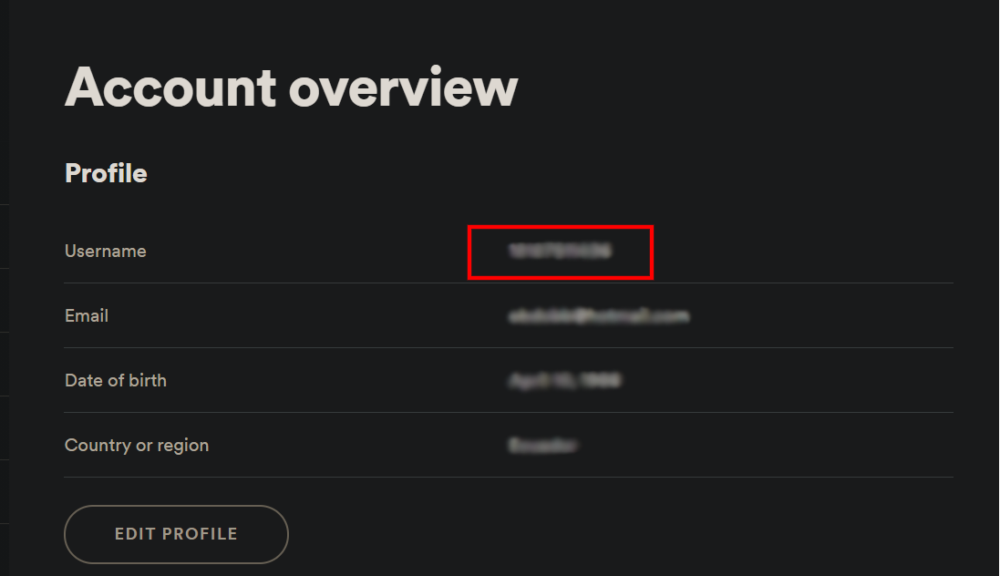
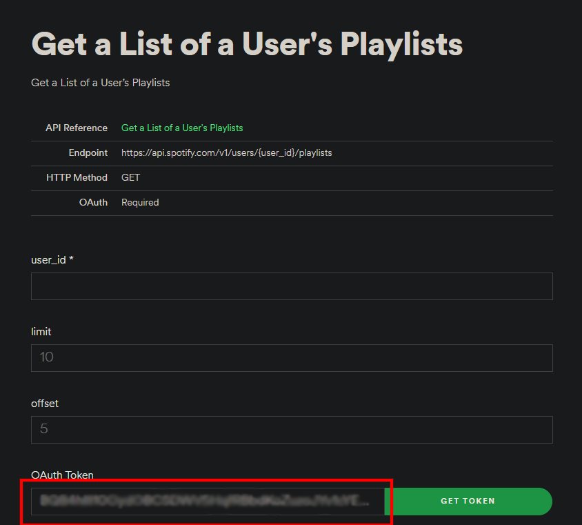
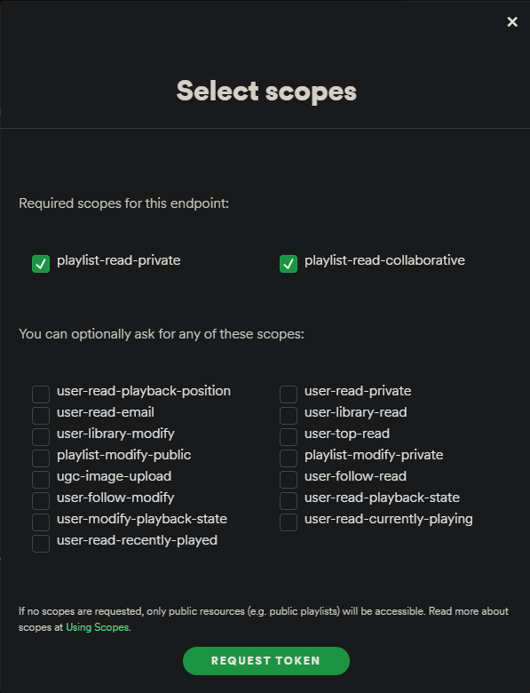

# Spotify Playlist Downloader

A simple GUI that will download .mp3 files coming from Spotify playlists.

## Description

This program uses a Tkinter GUI to allow a user to download .mp3 files from all the songs coming from either a User Owned playlist, or a User Followed playlist in Spotify. 
It discards the songs that contain the words "live" or "official video" so you can download the studio versions.

It was inspired by the project shown in this [video](https://www.youtube.com/watch?v=7J_qcttfnJA/) created by [TheComeUpCode](https://github.com/TheComeUpCode). 

## Table of Contents

* [Video](#Video)
* [Technologies](#Technologies)
* [Setup](#Setup)
* [Usage](#Usage)
* [Some extra information](#Some extra information)

## Video

Check out the Youtube [video](https://www.youtube.com/watch?v=la8NWPAeoY0) for an explanation of how the GUI works and what are the requirements.

## Technologies

* [Spotify Web API](https://developer.spotify.com/documentation/web-api/)
* [Youtube Data API](https://developers.google.com/youtube/v3)
* [Requests Library v2.25.1](https://requests.readthedocs.io/en/master/)
* [Youtube-dl v2021.02.10](https://github.com/ytdl-org/youtube-dl/)

## Setup

1. Install all dependencies:\
`pip install -r requirements.txt`

   
2. Get Spotify User ID:

Log in to Spotify and then go here: [Account Overview](https://www.spotify.com/us/account/overview/). The User ID is the series of characters marked in the image below:

 

After you have the digits, copy them in the attached `secrets.csv` file next to the user id cell.

3. Get the Spotify Web API OAUTH Token:

To get your Token, you should go to: [Get a List of a User's Playlists](https://developer.spotify.com/console/get-playlists/) and then in the bottom part click the **Get Token** button.

Check the boxes shown:

Once again, copy the Token in the `secrets.csv` file attached.

4. Get the Youtube Data API key:

Go to [Google Cloud Platform](https://console.cloud.google.com/) and follow the steps in this [Youtube Video]() to get the key. 
Copy it in the `secrets.csv` file.

It's important to mention that the free Youtube Data API key only allows 100 searches per day, so if the playlist contains more than 100 songs, you will need to wait until the next day or generate another key. 

## Usage

Finally, you have 2 options to run the script:

* The first one is to run the `download_playlist.py` file attached in any IDE. 
* The second one is to run the `download_playlist.exe` file.

## Some extra information

The first time you run the script a `.pickle` file will be generated. DO NOT ERASE IT, since the script uses it to store the daily Youtube API quotas.

The script generates a `.txt` log file in a human readable form to list the downloaded songs from every playlist. This is useful to keep track of how many songs are missing in playlists with more than 100 elements.

